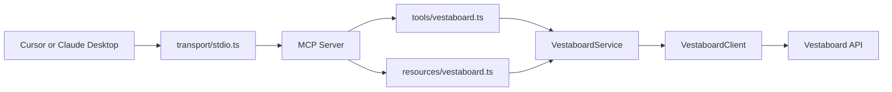

# Vestaboard MCP

A production-quality Model Context Protocol server that exposes Vestaboard as a controllable hardware device. The server starts with stdio for local MCP hosts such as Cursor and Claude Desktop, while keeping transport, MCP registration, services, API clients, configuration, and shared models separate.

## Architecture

The MCP layer is intentionally thin. Tool and resource handlers validate input, log invocation, call `VestaboardService`, and return structured MCP responses. All Vestaboard business behavior lives in the service layer, and all HTTP/auth/retry behavior lives in the client layer.



## Project Layout

- `src/index.ts`: composition root.
- `src/transport/stdio.ts`: stdio transport startup.
- `src/transport/http.ts`: future Streamable HTTP extension point.
- `src/tools/vestaboard.ts`: atomic MCP tools.
- `src/resources/vestaboard.ts`: current display resource.
- `src/prompts/vestaboard.ts`: optional composition prompt.
- `src/services/VestaboardService.ts`: formatting, validation, preview, send, clear, and current display operations.
- `src/clients/VestaboardClient.ts`: Vestaboard API authentication, HTTP, retries, timeouts, and response parsing.
- `src/models/Vestaboard.ts`: shared types.
- `src/config/env.ts`: environment parsing.
- `src/util/logger.ts`: stderr logger safe for stdio MCP servers.
- `src/util/errors.ts`: typed errors and structured error mapping.

## MCP Capabilities

Tools:

- `vestaboard_send`: format and send `{ text: string }`.
- `vestaboard_preview`: format `{ text: string }` without sending.
- `vestaboard_clear`: clear the board by sending a blank 6x22 character grid.

Resources:

- `resource://vestaboard/current`: reads the current display state from the configured Vestaboard API. If credentials or the selected API mode cannot support the read, the resource returns a structured unsupported/error payload.

Prompts:

- `vestaboard_compose_message`: optional helper prompt for concise board-friendly copy.

## Configuration

Copy `.env.example` to `.env` and fill in the values for your API mode.

```bash
cp .env.example .env
```

Environment variables:

- `VESTABOARD_API_MODE`: `cloud` or `local`.
- `VESTABOARD_CLOUD_API_TOKEN`: required when sending or reading in cloud mode.
- `VESTABOARD_LOCAL_BASE_URL`: local device base URL, defaults to `http://vestaboard.local:7000`.
- `VESTABOARD_LOCAL_API_KEY`: required when sending or reading in local mode.
- `VESTABOARD_REQUEST_TIMEOUT_MS`: request timeout in milliseconds.
- `VESTABOARD_RETRY_COUNT`: retry attempts for network, rate-limit, and server failures.
- `LOG_LEVEL`: `error`, `warn`, `info`, or `debug`.

Credentials are not required to start the server or run `vestaboard_preview`. They are required for API-backed capabilities such as `vestaboard_send`, `vestaboard_clear`, and `resource://vestaboard/current`.

## Run Locally

```bash
npm install
npm run build
npm run dev
```

`npm run dev` starts the MCP server over stdio. Do not write normal logs to stdout in a stdio MCP server; this project logs to stderr through `src/util/logger.ts`.

## Cursor Setup

Build the project first:

```bash
npm run build
```

Then add a local MCP server entry that runs:

```bash
node /Users/jeremybailey/CascadeProjects/SpeechSessionMVP/vestaboard-mcp/dist/index.js
```

Use the environment variables from `.env` or configure them in Cursor's MCP server environment settings.

## Claude Desktop Setup

After building, add an MCP server entry similar to:

```json
{
  "mcpServers": {
    "vestaboard": {
      "command": "node",
      "args": [
        "/Users/jeremybailey/CascadeProjects/SpeechSessionMVP/vestaboard-mcp/dist/index.js"
      ],
      "env": {
        "VESTABOARD_API_MODE": "cloud",
        "VESTABOARD_CLOUD_API_TOKEN": "your-token"
      }
    }
  }
}
```

Restart Claude Desktop after updating its MCP configuration.

## Future HTTP Transport

The future Streamable HTTP transport belongs in `src/transport/http.ts`. It should reuse the same server composition, tool registrations, services, clients, logger, and config. Business logic should remain in `VestaboardService`, not in HTTP request handlers.

## Extending The Integration

This server should remain an atomic Vestaboard capability. Workflow-specific integrations such as ClickUp, Slack, GitHub, Google Calendar, Home Assistant, or other hardware should be implemented as separate MCP servers or separate clients that Claude can compose with this server.
